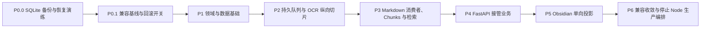

# Study App 后端迁移总路线图

> **For agentic workers:** REQUIRED SUB-SKILL: Use superpowers:subagent-driven-development (recommended) or superpowers:executing-plans to implement this plan task-by-task. Steps use checkbox (`- [ ]`) syntax for tracking.

**Goal:** 以可回滚、测试先行的纵向切片，将 Study App 的生产业务编排从 Node 迁移到 FastAPI，同时保持 React、Paper ID、旧 `/api`、旧字段、SQLite 数据与 MCP 行为兼容。

**Architecture:** 迁移以 `DocumentSourcePipeline`、`GenerationPipeline`、`ProcessingQueue`、`ContextBuilder`、`ObsidianExporter`、`CredentialStore` 六个深模块为主干。FastAPI Route、Node 兼容 Adapter、Worker、MCP 和 React Gateway 都只调用这些 Interface；SQLite 新表只做加法迁移，旧字段在验证期继续回退与双写。

**Tech Stack:** FastAPI、Pydantic v2、SQLAlchemy 2、Alembic、SQLite WAL、httpx.AsyncClient、anyio、PyMuPDF、pymupdf4llm、React、TypeScript、Vitest、Node test runner。Python 依赖必须从 P1 建立的带 hash 锁文件安装，Node/React 依赖只用已提交的 lockfile 与 clean/frozen install；任何阶段不得用未锁定的范围版本生成生产 evidence。

---

## 不可变约束

- Paper ID 始终沿用 `papers.id`，任何迁移、导出、任务或 Artifact 都不得重编号。
- `sourceMode` 只有 `native | ocr`；默认 `native`，未明确选 `ocr` 时 Provider 调用次数必须为 0。
- `native` 严格保留 pymupdf4llm → PyMuPDF plain-text fallback；`ocr` 失败不得静默改走 `native`。
- 真实 DeepSeek OCR 协议未被本地资料验证时，不构造其 HTTP 请求、不上传文件、不猜测 endpoint、鉴权、模型或响应字段。
- P1 创建五张领域主表：`document_sources`、`generated_artifacts`、`processing_jobs`、`document_chunks`、`obsidian_exports`。P2 在主表上 additive 增加 source 的 `source_key/ready_at/stale_at`、artifact 的 `artifact_key/ready_at/stale_at`、job 的 `source_document_id/artifact_id/spec_json/available_at/lease_owner/lease_token/lease_expires_at/heartbeat_at/cancel_requested_at/result_json/updated_at/retry_of_job_id/retry_sequence`，创建 `paper_artifact_heads`、`processing_job_events`、`ocr_page_checkpoints` 三张辅助表，并安装 exact `processing_jobs_spec_guard_insert|processing_jobs_spec_guard_update`。`spec_json` 是 non-null canonical v1 JobSpec 与重启恢复的唯一业务请求来源，旧 P1 job columns全部保留。P3 additive 扩展 `document_chunks` 的 status/content kind/cache/version/source hash/offset/timestamp 字段，并创建 `document_chunk_embeddings`、`artifact_translation_checkpoints`、FTS5 虚表 `document_chunks_fts` 及 exact `document_chunks_fts_ai|document_chunks_fts_ad|document_chunks_fts_au`。P3 后 schema trigger 名称集合与总数固定为上述五个。P4–P6 的 schema inventory、备份 fingerprint、恢复与回滚验证必须覆盖主表、辅助对象、`processingJobs`/`processingJobSpecs` count/hash/strict decode与五 trigger normalized SQL SHA；`papers.explainer`、`translations`、`notes`、`paper_vectors` 及所有旧 job columns 不删除。
- `ingest_jobs` 是旧采集审核任务，不等于新的 `ProcessingJob`，不可共用状态机。
- FastAPI Route 不执行 OCR、LLM、文件写入、长 SQL、重试或 Obsidian 模板；这些行为隐藏在 Application Interface 后。
- FastAPI 默认只绑定 `127.0.0.1`，不信任 `Forwarded`/`X-Forwarded-*`；带 Origin 的写请求必须同源。非 loopback bind 未同时显式设置 `ALLOW_REMOTE_ACCESS=1` 时在打开 socket/DB/provider 前 fail-fast；P0–P6 默认部署不启用远程访问。
- Node 在所有兼容门禁通过前继续可启动；不在本路线图中删除 `server.js`。
- 不修改 React 布局、CSS、路由、动画或无关组件；只允许类型、Decoder、Gateway、Query Hook、最小状态控件和测试连接。
- 每个切片必须先观察预期红灯，再写最小生产实现；子计划须为 RED 与 GREEN 两次执行分别列出完整、可复制的命令，未完成验证不得进入下一切片。
- Composition root、FastAPI app factory、Worker/Scheduler CLI 都接收本阶段冻结的 `required_schema_revision`，且只接受唯一 current revision：P1=`20260807_01`、P2=`20260807_02`、P3–P6=`20260807_03`。不得把 P1 head 写死并沿用到后续阶段，也不得以 `head` 动态解析替代阶段期望值。
- `required_schema_revision` 必须是 keyword-only 且无默认值；任何 app factory、API/Worker/Scheduler CLI 或测试 fixture 漏传时都在 socket/DB/provider/lease 前 fail-fast。阶段计划必须同时覆盖 missing/multiple/wrong/exact 四态测试。
- `OriginReceipt`、`BuildIdentityManifest`、`DatabaseEvidenceIdentityManifest`、`ProductionStartupSnapshot` 与 `HandoffReceipt` 是五种不可互换的 typed identity artifact。P0 只有在一份 exact backup/Manifest 通过独立 verify/restore-check 后，才以 fixed-path O_EXCL 产生 `OriginReceipt`；它绑定 backupId、exact backup/Manifest/receipt paths、backup/Manifest/logical hashes、databaseLineageId、canonical receiptSha256，且 P0 evidence 另固定 exact receipt file SHA。`BuildIdentityManifest` 只绑定 gitRevision、dirty-aware sourceTreeHash、部署 bundle、frontend assets、resolved Compose 与 image digest；`buildId` 是 canonical content digest，文件只能是 bound identity root 下 O_EXCL 创建、不可覆盖的 `frozen-build-identity-<buildId>.json`，任一 source/build byte变化必须得到新 buildId与新路径。`DatabaseEvidenceIdentityManifest` 只绑定已由 exact OriginReceipt 锚定的 lineage、具体 SQLite file identity、subjectKind、parent backup/Manifest 与父 subject chain。P6 `ProductionStartupSnapshot` 以 exact path/file SHA绑定 final run、build、Live database、OriginReceipt、roles、完整 production mode map与 frozen Node rollback map；promotion authorization再绑定该 snapshot。成功 promotion 后 O_EXCL写 `HandoffReceipt`，绑定 run/authorization/cutover/startup/build/database/origin/owner/role-lock/process/smoke identities，供常驻协调器或新进程执行 restart-safe rollback。P4–P6 不得从临时传入的 backup pair 新建另一个 origin 或重置 databaseLineageId。命令操作当前 subject 时参数名固定为 `--database-identity-manifest`；只有创建 descendant/installed subject 时，父 subject参数名固定为 `--parent-database-identity-manifest`，child manifest 则由显式 output 参数返回。所有 CLI 都必须使用准确的 typed参数和 exact path/SHA，禁止 `--parent-live-database-identity-manifest`、泛化 manifest、latest/glob、路径或当前内容 hash 猜测另一种 identity。
- P4 在产生任何 Live owner evidence 前，必须通过唯一 `initialize-node-owner` Interface 原子 exclusive-create `data/compatibility/runtime/production-owner.json`。初始化只证明既有 Node owner，不切换 owner；`create-live-database-identity`、`initialize-node-owner` 与只读 `verify-node-owner` 都显式消费并验证同一 P0 OriginReceipt exact path/file SHA，再由 receipt 指向的 backup/Manifest 重做独立验证，绑定 exact Live `DatabaseEvidenceIdentityManifest`、runtime namespace、resolved absolute `server.js` path、Node cwd/PID/argv/loopback port/DB handle，并拒绝 receipt/pair drift、missing/multiple Node、同 basename 不同目录 entrypoint、任一 Live Python role、已存在 marker 或 identity mismatch。marker 已存在时只能调用独立只读 `verify-node-owner`，不得重跑初始化、覆盖或把失败当成功。P4 此后只读 marker；P6 只允许 coordinator 对它执行 `node_active → node_quiesced → handoff_pending → python_active|node_active` CAS。
- P4 与 P5 的 fixed inventory fingerprint 必须在同一隔离 subject 的 before/after 中精确覆盖 12 张 legacy 表、五张 P1 主表、三张 P2 辅助表、两张 P3 物理表、`alembic_version=20260807_03`、`processing_jobs` frozen ordered columns（含 non-null `spec_json`）、`processingJobs`/`processingJobSpecs` count/hash/strict decode、`document_chunks_fts` logical content/external-content rowid join，以及 trigger 名称总数精确为 5：`processing_jobs_spec_guard_insert|processing_jobs_spec_guard_update|document_chunks_fts_ai|document_chunks_fts_ad|document_chunks_fts_au`。五个 trigger 都固定 normalized SQL SHA，三个 FTS trigger另固定 insert/delete/update behavior oracle；漏对象、rename、额外 lookalike trigger 或任一未解释 count/PK/row/schema/hash delta 都阻止阶段完成。
- 所有**提交给 P6 preflight、convergence 或 shutdown gate** 的 evidence 必须由 P6 唯一 `capture-evidence` wrapper exclusive-create。P4/P5 自身 RED/GREEN、inventory 与阶段出口日志仍按各自 scoped gate 运行，它们不是 P6 capture record，也不要求依赖未来才由 P6 交付的 wrapper；P6 必须在对应 content-addressed BuildIdentityManifest 冻结后重跑相同行为并 capture，禁止复制、重命名或“升级”P4/P5 日志。provisional 与 final 都先由 `create-evidence-run` 通过 P0 `BoundRoot` 创建此前不存在的 fresh `run-<runId>/` 与 strict `EvidenceRunManifest(phase=provisional|final)`；除 immutable external identity外，summary、fixture、backup、restore copy、descendant identity与 evidence全在该 run root。final record另显式绑定 canonical ProductionStartupSnapshot path/SHA及 CutoverLease/token identity。所有 test/check suite先生成 strict JSON/JUnit machine summary，wrapper只从 artifact读取 totals/failures/skips并交叉检查 raw exit；`exit 0 + skips>0` 仍失败。每套件使用独立临时 DB/settings/PDF/Vault/Fake Keyring与 deny-live/network/provider tripwire，必须报告 `liveAccessCount=0`。provisional 或 final 的 BuildIdentityManifest 都必须在该 phase 第一个 capture 前创建并验证；裸终端输出、控制台文本解析、手写 pass boolean、manifest 创建前的 capture、跨 run copy 或事后升级 stage-local/provisional artifact 都不能进入 P6 gate。failed/aborted run 永久 seal；retry 必须新 runId，source/build变化还必须新 buildId/path。
- 用户已授权创建一个独立 `codex/` 分支并在安全门禁全绿时连续实施 P0→P6；仍不得暂存、提交或推送，除非用户另行明确授权。

## 统一领域术语与公开 Interface

| 术语 | 含义 | 公开 Interface |
|---|---|---|
| `Paper` | 论文元数据与稳定身份 | Repository 保持原 `paper_id` |
| `SourceDocument` | 由 PDF 物化出的规范 Markdown，模式为 native 或 ocr | `materialize_source(paper_id, source_mode, purpose)` |
| `GeneratedArtifact` | 依赖一个 SourceDocument；kind 恰为 explainer、translation、summary、outline、study_card、classification 或 metadata | `generate_artifact(paper_id, artifact_kind, source_mode)` |
| `ProcessingJob` | 持久化的 source_materialize、ocr、explain、translate、embed、obsidian_export 或 obsidian_sync 任务 | `enqueue/get/cancel/retry/list/claim_next/report_progress/complete/fail` |
| `VaultProjection` | 应用数据到 Obsidian 受管文件的单向投影 | `export_paper(paper_id, export_options)` |
| `ProviderProfile` | 第三方 Provider 的非敏感配置 | Settings Application Interface |
| `Credential` | canonical kind 精确为 `llm|ocr|embedding|semantic_scholar`；依次映射 `LLM_API_KEY/OCR_API_KEY/EMBED_API_KEY/S2_API_KEY`、Keyring `credential:{kind}` 与 legacy `apiKey/ocrApiKey/embedApiKey/s2ApiKey` | `get/is_configured/key_tail/update/clear` |

## 固定 `/api/v2` 资源树

- `POST|GET /api/v2/papers/{paper_id}/sources`
- `POST /api/v2/papers/{paper_id}/artifacts/explainer`
- `POST /api/v2/papers/{paper_id}/artifacts/translation`
- `POST /api/v2/papers/{paper_id}/artifacts/classification`
- `POST /api/v2/papers/{paper_id}/artifacts/metadata`
- `POST /api/v2/papers/{paper_id}/artifacts/summary`
- `GET /api/v2/papers/{paper_id}/artifacts`
- `POST /api/v2/papers/{paper_id}/index`
- `GET /api/v2/papers/{paper_id}/index-status`
- `POST /api/v2/search/chunks`
- `GET /api/v2/jobs`、`GET /api/v2/jobs/{job_id}`、`GET /api/v2/jobs/{job_id}/events`
- `POST /api/v2/jobs/{job_id}/cancel`、`POST /api/v2/jobs/{job_id}/retry`
- P5 增加 `POST /api/v2/papers/{paper_id}/exports/obsidian`、`POST /api/v2/obsidian/sync`、`GET /api/v2/obsidian/status`、`POST /api/v2/obsidian/test`

所有 JSON request/response/query 字段使用 P2/P3 冻结的 camelCase wire contract，包括 `sourceMode`、`sourceDocumentId`、`paperId`、`jobType`、`afterSequence` 与 `includeEmbeddings`。禁止 generic jobs/artifacts/obsidian create、顶层 sources/artifacts/exports，以及第二套 v2 router/schema。

## 阶段依赖图



## 计划文档与阶段出口

### P0.0：SQLite 一致性保护

执行：`docs/superpowers/plans/2026-08-07-p0-sqlite-backup-rollback-slice.md`

出口：backend 备份测试全绿；P0.0 Task 5/5A 的发布后 rewrite、Manifest strictness、cleanup precedence、exclusive-file identity 与 bound restore-root 定向安全测试全部通过，独立规格审查和质量审查均 Important=0；此后 Live 快照独立 `verify` 与 `restore-check` 全绿；备份、恢复目录无 sidecar/临时残留；Live 主文件 size/mtime 未因流程改变；固定路径 `OriginReceipt` 只在上述 gate 后 O_EXCL 创建并独立复验，实施 evidence 记录 exact receipt path/file SHA、backupId、backup/Manifest/logical hashes 与 databaseLineageId。P0 `BoundRoot` 的 Windows no-delete-share handle与 POSIX dirfd/openat/renameat/O_NOFOLLOW contract必须保留可注入 seam；P6 将用 deterministic 双平台 fixture消除宿主平台 `skipped=1`，不得通过放宽 zero-skip gate处理。完整套件若 non-zero 不得称为绿色，只允许进入 P0.1 的 baseline capture task。

### P0.1：现有契约与默认关闭基线

执行：`docs/superpowers/plans/2026-08-07-p0-compatibility-baselines.md`

出口：两次 fresh 完整 frontend Vitest capture 一致后生成 `contracts/pre-existing-test-failures-v1.json`；Node 通过临时 DB、OS-assigned loopback port 黑盒启动现有 `server.js` 冻结全部 HTTP/NDJSON，只有窄 listen seam 且 route body 不搬迁；`agent/__main__.py` dispatch 不改。Python native、React Gateway、MCP 九工具 characterization 可重复；OCR spy 为 0；回滚开关非法值 fail-fast。P1–P5 只可在既有 non-zero 的完整 IDs/signatures/related hashes 与 v1 完全一致且切片未改相关路径时推进，必须报告 raw non-zero/`overallGreen=false`；任何漂移立即停止。

### P1：领域与数据基础

执行：`docs/superpowers/plans/2026-08-07-p1-domain-data-foundation.md`

出口：Alembic `20260807_01` 可在隔离副本 upgrade → downgrade → upgrade；五张 P1 领域主表、Repository、NativeExtractor、DocumentSourcePipeline、GenerationPipeline、旧字段回退与 dual-write 全部通过；历史产物没有伪造 SourceDocument 来源。

### P2：队列与 OCR 最小纵向切片

执行：`docs/superpowers/plans/2026-08-07-p2-processing-queue-ocr-vertical-slice.md`；真实 Adapter 条件计划：`docs/superpowers/plans/2026-08-08-p2-deepseek-ocr-adapter-conditional.md`

出口：持久化单 Worker 可恢复、取消、重试、幂等 claim；`processing_jobs.spec_json` 是 non-null canonical v1 JobSpec，enqueue/claim/retry/orphan recovery逐字节复用且不能从 progress/current Settings重建，两个 exact spec guard trigger已安装；备份 inventory固定 `processingJobs`/`processingJobSpecs` count/hash/strict decode。Fake OCR 打通 `sourceMode=ocr → SourceDocument → explainer → 来源关系 → job status`；native 零 OCR；OCR 失败不回退。条件计划默认 blocked；资料缺失时 DeepSeek 固定 `OCR_PROVIDER_CONTRACT_UNVERIFIED`/503/零 transport 且不能声称真实能力完成。若用户提供完整官方资料，条件计划的 auth/request/upload-or-render/Markdown/error/timeout/429 bounded retry/page batch/recovery/cancel/verified sync-or-async poll fixture TDD 变为必执行完成门禁。

### P3：其余 Markdown 消费者与检索

执行：`docs/superpowers/plans/2026-08-07-p3-source-consumers-search.md`

出口：translation/classify/metadata/summary/embed/search 都复用 SourceDocument；ContextBuilder 不丢弃后半文档；翻译块可断点续跑；PDF、Provider、模型、选项、处理版本变化能 stale；FTS5 与 chunk embedding 命中可定位标题路径和页码。P3 head保留 P2 两个 spec guard并新增三个 FTS trigger，trigger exact总数为 5；upgrade/downgrade/restore inventory不得只验证 FTS三项。

### P4：FastAPI 接管

执行：`docs/superpowers/plans/2026-08-08-p4-fastapi-takeover.md`

出口：FastAPI candidate 在隔离 DB、随机 loopback port 与 candidate runtime namespace 同时承载 `/api/v2` 与旧 `/api` 兼容 Adapter；挂载 P2/P3 routers 而不复制 DTO/状态机，parity、每进程单角色、API/Worker/Scheduler 同 namespace 并存、Worker/Scheduler role-scoped singleton ownership、drain 与 frozen Node rollback candidate 演练通过。P4 的 create-live/initialize/verify 三条路径只使用 P0 fixed `OriginReceipt` exact path/file SHA 及其命名的 exact verified backup/Manifest 建立唯一 Live `DatabaseEvidenceIdentityManifest`，不创建新 lineage origin，并以 resolved absolute `server.js` identity 原子证明 `node_active` marker；已存在 marker 只经 `verify-node-owner` 无副作用复验。fixed inventory before/after 覆盖 12 legacy + 全部 P1/P2/P3/FTS、`processing_jobs` exact columns与 JobSpec projection，以及两个 spec guard + 三个 FTS trigger的 exact name/SQL SHA且零未解释 delta。Node 在 P4 前后始终是 Live HTTP/Worker/Scheduler production owner；P4 不停止 Live Node、不启动 Live Python roles、不 promotion。正式 shutdown/promotion 仅在 P6 shutdown gate。

### P5：Obsidian 投影

执行：`docs/superpowers/plans/2026-08-08-p5-obsidian-projection.md`

出口：单篇导出、批量同步、manifest、冲突、managed marker、原子替换和 PDF `none|reference|copy` 全绿；路径使用稳定 Paper ID；完整 Obsidian Settings、可选 auto-export、显式 pdfDir 迁移命令和最小 React Gateway/Hook 连接通过；同步绝不触发 OCR；Paper 删除零 Vault I/O，manifest orphan/tombstone 只供人工审查；用户文件与默认用户管理 Notes 不被覆盖。P5 在 fresh verified descendant 上复用 P4 fixed inventory CLI，before/after 对 12 legacy + 全部 P1/P2/P3/FTS、`processingJobs`/`processingJobSpecs` 与 exact five-trigger inventory零未解释 delta，Alembic 唯一 revision 仍为 `20260807_03`。

### P6：兼容收敛

执行：`docs/superpowers/plans/2026-08-08-p6-compatibility-convergence.md`

出口：所有实现/测试/Compose/静态文档先完成并冻结 content-addressed `BuildIdentityManifest`；provisional 与 final 分别由 `create-evidence-run` 建立 fresh immutable run。P6 先通过 deterministic Windows/POSIX BoundRoot fixture消除既有 backend `skipped=1`，再以 per-suite 临时 DB/settings/PDF/Vault/Fake Keyring、Live/network/provider deny tripwire和 machine-readable JSON/JUnit summary证明 raw exit 0、failures=0、skips=0、`liveAccessCount=0`。final run在 quiesce前 O_EXCL创建 canonical `ProductionStartupSnapshot`与 durable CutoverLease并启动 watchdog；snapshot path/SHA绑定 lease、authorization与 promotion。短暂只读收敛窗口的数量/`canonicalDataSha256`、`processing_jobs`/JobSpec projection与 exact five-trigger inventory严格一致；cutover backup 与 quiesced Live 等价只比较 `database_backup inspect.logicalSha256` 提供的 `backupCompatibleLogicalSha256`，两类 hash 不 alias/fallback/交叉比较。legacy reconciliation ledger 对每个非空 explainer/translation 按 `(paperId,kind)` 分类 `proven_migrated|legacy_only_unprovable|mismatch`，逐内容 hash、完整 sets/counts 与 provenance evidence 可重算，`mismatch=0`，不可证明项保持 legacy-only/null relation，notes/paper_vectors 仅保留核对；写 smoke 新表 delta 有逐行 evidence。固定顺序是 fresh final run → canonical startup/lease/watchdog → Live writers quiesce/零资源 → cutover create/verify/restore-check → machine-readable zero suites → strict convergence → isolated write-smoke/rollback/recovery/restore-install-rehearsal → shutdown authorization → atomic handoff。成功 handoff生成并验证 durable `HandoffReceipt`，常驻协调器或新进程可调用 `rollback-production`并在每个 crash boundary续跑；它不改 SQLite。任何 post-quiesce failure、operator/coordinator crash、heartbeat timeout或未使用/过期 authorization都统一保持 non-active、清 authorization、drain Python、释放 locks、启动 frozen Node、legacy smoke，最后才 CAS `node_active`；start/smoke失败仍保持 non-active。`restore-production-data` 与 application rollback分离，只在独立 recovery authorization/full-stop proof下复用 P0 BoundRoot。failed run seal、retry fresh run；source/build变化还需新 buildId/path。frozen Node、旧字段、旧表与回滚开关保留。

## 每个纵向切片的固定执行协议

所有可整块复制的 Windows PowerShell 验证命令统一使用下面的 helper；每个子计划的多命令 block 必须在 block 内重复定义它，不能假定调用者已经加载 profile 或使用 PowerShell 7：

```powershell
Set-StrictMode -Version Latest
$ErrorActionPreference = 'Stop'
function Invoke-CheckedNative {
  param(
    [Parameter(Mandatory = $true)][string]$Label,
    [Parameter(Mandatory = $true)][scriptblock]$Command
  )
  $output = & $Command
  $exitCode = $LASTEXITCODE
  if ($exitCode -ne 0) { throw "$Label failed with exit code $exitCode." }
  $output
}
```

禁止只设置 `$ErrorActionPreference='Stop'` 后假定 Windows PowerShell 会把 native non-zero 转成 terminating error。包含多个 native command、native pipeline 后继续解析/执行、或需要消费 JSON 的 block 中，每个 native command 必须经 `Invoke-CheckedNative`，或紧邻保存并检查 `$LASTEXITCODE`。唯一例外是一个 fenced block 中恰好只有一条 native command、没有后续 pipeline/解析/命令，且相邻文字明确要求观察并报告该命令的 raw RED/GREEN exit；此时 terminal raw exit 本身就是证据，不会被后续成功命令掩盖。不得把这种单命令 fence 与其他命令合并复制。其他允许的 non-zero 只有计划明确列出的预期 RED 或 guarded downgrade 分支，且该分支必须先保存 exit code再运行任何其他命令。

- [ ] **Step 1: 保护工作区**

运行 `git status --short --branch`，记录用户既有改动；禁止覆盖 `AGENTS.md`、`.agents/` 和任何不属于当前切片的文件。

- [ ] **Step 2: 读取本切片计划与依赖门禁**

只在上一阶段出口有最新验证证据时继续；真实 OCR contract 不完整时条件计划保持 blocked，不放宽 Fake/安全失败测试，也不声称真实能力完成。若用户已提供完整资料，条件计划不得跳过。

- [ ] **Step 3: 建立单个行为红灯**

测试只能跨预先确认的 Interface seam；运行精确测试名，并确认失败原因是缺失行为而非 import、fixture 或拼写错误。

- [ ] **Step 4: 写最小实现并观察绿灯**

只实现该断言要求的行为；运行子计划完整列出的 GREEN 定向测试，确认 0 failure 后再运行同模块回归。

- [ ] **Step 5: 完成规格审查与代码质量审查**

先逐条比对本切片需求，再检查事务、连接关闭、SQLite 锁、TOCTOU、路径 containment、秘密泄漏、错误分类与测试有效性；有问题必须修复并复审。

- [ ] **Step 6: 做迁移与运行时回滚演练**

Schema 切片必须在 P0 恢复副本执行 upgrade → validate → downgrade → validate → upgrade；Live 只在隔离演练通过后升级。运行时回滚优先切回旧读写开关并保留 additive 新表。

- [ ] **Step 7: 运行本阶段全量验证并按门禁连续推进**

报告执行命令、通过数、raw failure exit、迁移 revision、数量/hash 与未运行项。P1–P5 遇到 non-zero 只在 P0.1 v1 完整集合/签名/相关文件 hash 精确匹配且本切片未改相关路径时可继续，并明确 `overallGreen=false`；新增/变化立即停止。P6 最终必须全套 raw 0 failure，除非用户明确批准改变完成标准。

## 全局迁移与回滚顺序

升级前固定执行：P0 `create` → 使用返回的精确路径 `verify` → 精确路径 `restore-check` → 在 P0 `BoundRoot` 持续绑定的隔离恢复副本做 Alembic upgrade/validate/downgrade/validate/upgrade → validator 对比冻结的 12 张旧表 `papers|progress|paper_reviews|notes|favorites|translations|paper_vectors|cite_edges|ingest_jobs|job_candidates|job_schedules|schema_migrations` 的 count/hash → 从 P2 起逐阶段复验 `processingJobs`/`processingJobSpecs` count/hash/strict decode与 exact trigger inventory → 停止所有 writer → Live additive upgrade。Windows restore/install全程持有 no-delete-share root handle；POSIX只通过 dirfd/openat/renameat/O_NOFOLLOW解析与替换；root/parent swap或能力不足在首次写前 fail closed。

运行时回滚固定值（全部在进程启动时读取一次形成 immutable startup snapshot；修改后必须按 drain 顺序重启，运行中环境变化不得热切换 owner、provider、credential 或路由）：

```text
RUNTIME_ENVIRONMENT=live
RUNTIME_NAMESPACE=production
API_BACKEND_MODE=legacy
DOCUMENT_PIPELINE_MODE=legacy
GENERATION_PIPELINE_MODE=legacy
ARTIFACT_READ_MODE=legacy
ARTIFACT_WRITE_MODE=legacy
OCR_ENABLED=0
OBSIDIAN_ENABLED=0
PAPER_STUDY_MCP_MODE=legacy
UI_ENTRY=react
```

回滚启动 frozen Node 按 durable owner phase分三条入口但共享一个尾序：`armed|node_quiesced|authorization_issued` 由 FinalWindowCoordinator凭 exact EvidenceRunManifest/lease/owner-only token/startup/build/database/origin identity abort，不要求 promotion authorization；已接管但尚无成功 receipt 的 `handoff_pending` 由 ProductionPromotionCoordinator及 durable handoff lease恢复；已成功 `python_active` 并写 HandoffReceipt 后，由常驻 ProductionOwnershipCoordinator或新进程调用 `rollback-production`。统一尾序是保持 `node_quiesced|handoff_pending` 非 active → 清 authorization → drain Python/停止新流量与 claim → 释放 role locks与连接 → 按 canonical startup snapshot中的完整 frozen map启动 Node → legacy smoke → 最后才 CAS `node_active`。start/smoke失败保持 non-active；abort/rollback crash可从 durable lease续跑，same token/receipt成功重试零副作用，不同 token/receipt/run/identity fail closed。`rollback-production` 不移动、恢复、downgrade或写入 SQLite 内容。

最终生产 promotion 固定值只允许在 P6 所有实现/配置完成、content-addressed BuildIdentityManifest 冻结、fresh final EvidenceRunManifest与 canonical ProductionStartupSnapshot/lease/watchdog ready、Node writers 经 owner-marker CAS quiesce、quiesce 后 cutover backup独立 verify/restore-check，并在同 run root 重跑 machine-summary zero-skip suites、strict convergence、explained write smoke、frozen Node rollback、Python recovery、隔离 restore-install-rehearsal 后启用。shutdown gate 必须以 exclusive-create 返回绑定 exact run/lease/startup/build/database/origin/cutover identity 的短期单次 authorization；先 drain/停止 Node 业务进程并记录零 PID/端口/DB-handle evidence，再由 launcher同时消费 authorization与 snapshot启动 Python roles，禁止只改其中一项、逐项重建 snapshot或热切换：

```text
RUNTIME_ENVIRONMENT=live
RUNTIME_NAMESPACE=production
PROMOTION_AUTHORIZATION_PATH=<shutdown gate exact path>
PROMOTION_AUTHORIZATION_SHA256=<shutdown gate exact SHA-256>
PRODUCTION_STARTUP_SNAPSHOT_PATH=<canonical snapshot exact path>
PRODUCTION_STARTUP_SNAPSHOT_SHA256=<canonical snapshot exact SHA-256>
P6_FINAL_EVIDENCE_RUN_ID=<exact runId>
P6_FINAL_EVIDENCE_RUN_MANIFEST_PATH=<exact run manifest path>
P6_FINAL_EVIDENCE_RUN_MANIFEST_SHA256=<exact run manifest file SHA-256>
P6_FINAL_WINDOW_LEASE_PATH=<exact durable lease path>
P6_FINAL_WINDOW_TOKEN_FILE=<owner-only token file path>
BUILD_IDENTITY_MANIFEST_PATH=<frozen-build-identity-{buildId}.json exact path>
BUILD_IDENTITY_MANIFEST_SHA256=<authorization-bound exact SHA-256>
DATABASE_IDENTITY_MANIFEST_PATH=<live-database-identity-v1.json exact path>
DATABASE_IDENTITY_MANIFEST_SHA256=<authorization-bound exact SHA-256>
API_BACKEND_MODE=python
DOCUMENT_PIPELINE_MODE=p1
GENERATION_PIPELINE_MODE=p1
ARTIFACT_READ_MODE=prefer_new
ARTIFACT_WRITE_MODE=dual
OCR_ENABLED=0
OBSIDIAN_ENABLED=0
PAPER_STUDY_MCP_MODE=application
UI_ENTRY=react
```

`OCR_ENABLED=0` 与 `OBSIDIAN_ENABLED=0` 仍是最终默认；用户显式启用属于独立 startup choice，不是后端 owner promotion 的隐式副作用。Runtime 必须在 socket/DB/provider/role-lease 前验证 authorization、EvidenceRunManifest、ProductionStartupSnapshot、CutoverLease/token hash、source/build/database lineage+subject/runtime namespace和 Node quiesce evidence；`begin_handoff` 原子接管 watchdog lease后才执行 `node_quiesced → handoff_pending → python_active`。Worker/Scheduler 分别获取 role-scoped locks，API/MCP 不共享这把锁。promotion 后必须运行 Python API/Worker/Scheduler/MCP 与 `/workspace/`、`/legacy/` smoke；成功必须生成、落盘并重新 hash验证 durable HandoffReceipt，owner marker引用其 exact path/SHA，常驻协调器接管 post-handoff恢复。任一步失败都按统一尾序恢复 frozen Node；schema保持 additive，authorization与 failed run不可复用。

应用代码回退只调用 `rollback-production`并保留全部新增表、`processing_jobs.spec_json`、五个 trigger与旧字段；旧 Node/Python继续使用 `papers.explainer`、`translations`、`notes` 和 `paper_vectors`。schema downgrade不是 runtime rollback，只允许在已证明新表没有唯一价值的隔离副本按阶段专用 destructive flag演练，Live不得沿用该 flag。真实数据恢复是另一个显式 `restore-production-data` Interface：要求独立 recovery authorization、full-writer-stop proof、exact backup/Manifest/OriginReceipt/database identity、保留当前 Live文件与 P0 BoundRoot原子安装，并明确快照之后的数据会丢失；promotion authorization、HandoffReceipt、P0 restore-check或 rehearsal flag都不能替代该授权。

## 全局验证命令

每阶段按改动范围运行精确测试，阶段出口至少运行：

```powershell
Set-StrictMode -Version Latest
$ErrorActionPreference = 'Stop'
function Invoke-CheckedNative {
  param([Parameter(Mandatory = $true)][string]$Label, [Parameter(Mandatory = $true)][scriptblock]$Command)
  $output = & $Command
  $exitCode = $LASTEXITCODE
  if ($exitCode -ne 0) { throw "$Label failed with exit code $exitCode." }
  $output
}
Invoke-CheckedNative 'backend tests' { .\.venv\Scripts\python.exe -B -m unittest discover -s backend/tests -p "test_*.py" -v }
Invoke-CheckedNative 'legacy Python tests' { .\.venv\Scripts\python.exe -B -m unittest discover -s test -p "test_*.py" -v }
Invoke-CheckedNative 'MCP characterization' { .\.venv\Scripts\python.exe -B -m unittest discover -s test -p "test_mcp_server.py" -v }
Invoke-CheckedNative 'root Node tests' { npm.cmd test }
Invoke-CheckedNative 'full frontend Vitest' { npm.cmd run test:run --prefix frontend }
Invoke-CheckedNative 'frontend typecheck' { npm.cmd run typecheck --prefix frontend }
Invoke-CheckedNative 'frontend lint' { npm.cmd run lint --prefix frontend }
Invoke-CheckedNative 'frontend build' { npm.cmd run build --prefix frontend }
Invoke-CheckedNative 'frontend e2e' { npm.cmd run e2e --prefix frontend }
Invoke-CheckedNative 'git diff check' { git diff --check }
```

上面的 raw frontend command 适用于 P0 capture 与 P6 final-zero gate。P1–P5 的入口与出口不得直接把已知 non-zero 交给 helper；必须改为执行 `node scripts/pre-existing-failure-baseline.mjs verify --baseline contracts/pre-existing-test-failures-v1.json`，由 verifier 重跑完全相同的 full frontend command，并只在完整 IDs/signatures/related hashes 与 v1 exact match、当前切片未触碰相关路径时以进程 exit 0 返回 JSON。三个授权语义字段必须存在且严格解码：`baselineMatched` 为布尔 `true`、`observedSuiteExitCode` 为整数、`overallGreen` 为布尔值，并满足 `(observedSuiteExitCode == 0) == overallGreen`；字段缺失、类型错误或语义矛盾立即停止。verifier 可以附带 forward-compatible 的只读诊断字段（例如失败 IDs/hash 摘要），但这些字段不得覆盖、替代或改变上述三个授权字段，也不得被 operator 用作放宽门禁。任何 verifier non-zero 或基线漂移立即停止。P6 shutdown/final gate 不接受该例外；每条命令由 machine-summary runner产生 run-local JSON/JUnit，`capture-evidence`同时要求 child raw exit 0、failures=0、skips=0，且 suite isolation报告 `liveAccessCount=0`，不能从控制台文本推断通过。

## DeepSeek OCR Adapter 启动门禁

完整、默认 gated 的执行计划：`docs/superpowers/plans/2026-08-08-p2-deepseek-ocr-adapter-conditional.md`。

在以下脱敏资料进入 `docs/provider-contracts/deepseek-ocr/` 前，真实 Adapter 小节保持未执行，并由 Provider registry 在任何 transport 构造前返回 `OCR_PROVIDER_CONTRACT_UNVERIFIED`：

- 官方 API 文档 URL、抓取日期或版本/hash；
- 脱敏请求示例、成功响应与 429/4xx/5xx 响应 fixture；
- Authorization 说明、模型 ID、Base URL、Endpoint 与 method；
- PDF/图片支持方式、编码、字节/页数/分辨率限制；
- 同步或异步任务语义、轮询接口与 request/job ID；
- `Retry-After`、频率、免费额度与数据留存规则。

任何资料缺失都不能通过普通 DeepSeek `/chat/completions` 配置推断；不得要求或记录完整 API Key。

## 自审结论

- 阶段依赖：P0.0 → P0.1 → P1 → P2 → P3 → P4 → P5 → P6 是单向门禁，没有并行写 Live DB 的路径。
- Interface 一致性：统一使用 `sourceMode`、`SourceDocument`、`GeneratedArtifact`、`ProcessingJob`、`VaultProjection`；Node、FastAPI、React 与 MCP 只在 Adapter 层转换 wire 名称。
- 数据一致性：新表 additive、旧字段保留、双写同事务；`processing_jobs.spec_json` 与 exact five-trigger inventory贯穿 P2–P6 backup/restore/fingerprint；`prefer_new` 只有在查询成功且没有 eligible ready row 时才回退旧字段，新表 query/decode/repository 错误必须返回分类安全错误并 fail closed。历史来源不可证明时保持 legacy provenance，不制造外键关系。
- 回滚一致性：application rollback只切 owner/process/startup map并由 receipt/lease持久续跑，legacy smoke之后才恢复 `node_active`；破坏性数据恢复需要另一份 recovery authorization并复用 P0 BoundRoot，二者不共享命令或授权。
- 安全一致性：默认 OCR/Obsidian 关闭；LLM/OCR/Embedding API/Semantic Scholar 四类密钥不回显、不进日志，空白更新逐 kind 保留旧值；PDF/Vault 路径必须 realpath containment；MCP 查询不创建任务或写库；P6 suite使用独立 sandbox且 Live/network/provider tripwire为零。
- 前端范围：只允许 Gateway/Decoder/Hook/fixture 和现有设计体系内的最小状态连接，路线图没有 UI 重构任务。
